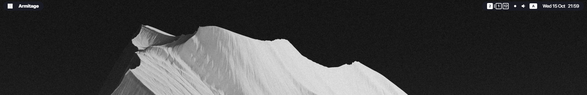

# MacOS-like Zebar

Zebar config for GlazeWM that requires build, but gets rid of remote resource pulling, therefore making Zebar fully operational offline

## Features

### Up status dot

Shows whether domain is up or down

- `white` - the domain is accessible

- `red` - the domain is not accessible

## Prerequisites 

1. San Francisco font

2. [Iosevka Nerd Font](https://www.nerdfonts.com/font-downloads)

## How to use

1. Copy files from `assets\` to `C:\Users\%USERNAME%\.glzr\zebar`

2. Install dependencies

    `npm install`

3. Build your bar

    `npm run build`

4. Copy your bar config from `dist\index.html` to `C:\Users\%USERNAME%\.glzr\zebar\index.html`
